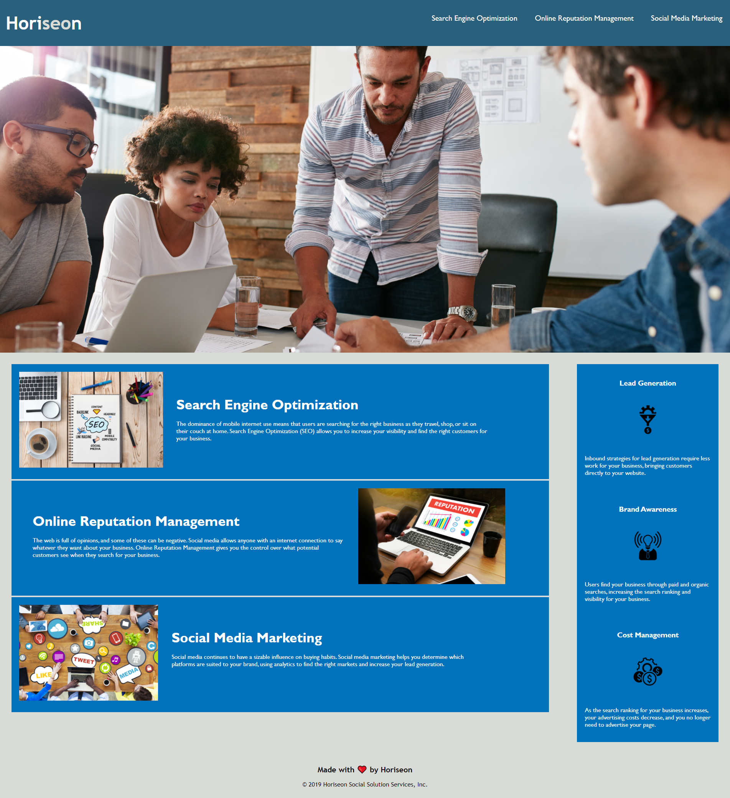

# This project was a refacotring project on code provided by Horizon Solution Services LLC.

# Refactoring this code included adding semantic HTML elements (headers, sections, navs, and footers). This helped created a locgical structure to the code independent of styling and positioning. In additition, alt tags were added to the image elements embedded in the HTML for accessibility purposes. 

# When it comes to the CSS, elements in the original sheet were duplicated. In an effort to refactor properly, elements were broken down and combined where applicable. The order of the style sheet was also re-orderd to align directly with the HTML. 

